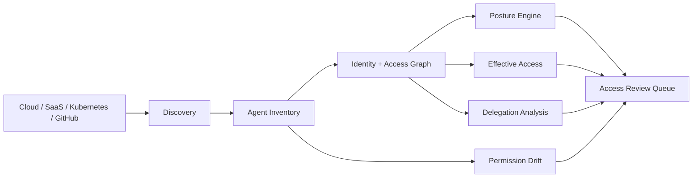

# AgentAtlas

Enterprise AI agent discovery, identity governance, effective-access analysis, delegation risk, permission drift, and shadow-agent detection.

## What AgentAtlas answers

- What AI agents and MCP/tool integrations exist?
- Which agents are unmanaged, shadow, orphaned, dormant, or overprivileged?
- Who owns and sponsors each agent identity?
- What sensitive resources can an agent effectively reach through tools and delegation?
- Has an agent's permission surface drifted?
- Does a downstream agent request exceed the authority delegated by the originating user?
- Which agents should be reviewed first?


## Architecture



## Baseline

The deterministic synthetic enterprise fixture contains 120 AI agents:

| Metric | Value |
|---|---:|
| Agents | 120 |
| Managed | 111 |
| Shadow | 9 |
| Orphaned | 6 |
| Dormant | 42 |
| High / Critical | 8 |
| Critical | 2 |

## Effective-access analysis

AgentAtlas distinguishes direct permissions from effective capability. An agent may have individually reasonable permissions that combine into a sensitive path.


Example:

```text
Finance Agent
  ├── reads → Warehouse
  │             └── contains → Customer PII
  └── can_call → External Messaging Tool

Finding:
Sensitive data can flow from an internal data source to an external destination through the same agent capability surface.
```

## Permission drift

AgentAtlas compares current and previous permission sets and scores privilege expansion.


```text
Yesterday
research-agent
├── docs.read
├── github.search
└── web.search

Today
research-agent
├── docs.read
├── github.search
├── web.search
├── secrets.read       NEW
└── repository.write   NEW
```

## Delegation guardrail

```text
Human
  │ grants READ
  ▼
Research Agent
  │ delegates
  ▼
Data Agent
  │ requests WRITE
  ▼
Customer Database

DENY
Reason: requested downstream capability exceeds originating authority
```

## Repository layout

```text
agentatlas/            core governance and graph logic
api/                   FastAPI service
dashboard/             Streamlit analyst workbench
assets/                README-native visuals
docs/                   threat model
reports/                deterministic baseline
tests/                  core and API tests
.github/workflows/      CI
```

## Run

```bash
python -m agentatlas.cli
python -m unittest discover -s tests -v
```

Dashboard:

```bash
pip install -r requirements-dashboard.txt
streamlit run dashboard/app.py
```

API:

```bash
pip install -r requirements-api.txt
uvicorn api.app:app --host 0.0.0.0 --port 8000
```

Docker:

```bash
docker build -t agentatlas .
docker run --rm -p 8000:8000 agentatlas
```

## Scope

All identities, agents, resources, permissions, and findings are synthetic. AgentAtlas is a defensive research and portfolio project; it does not connect to or modify real enterprise identities or production systems.
