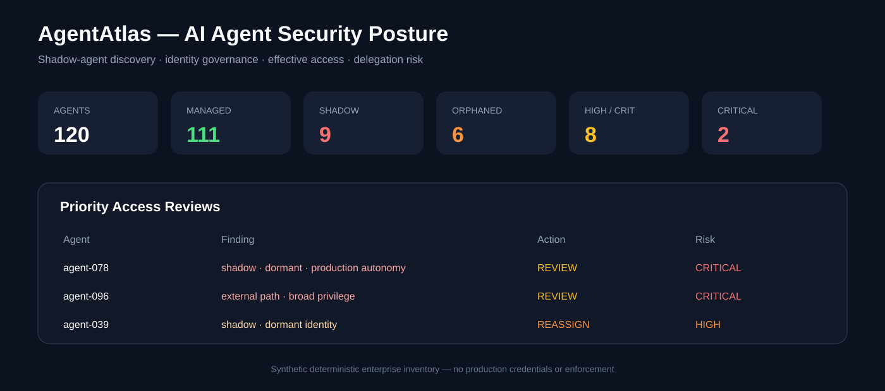
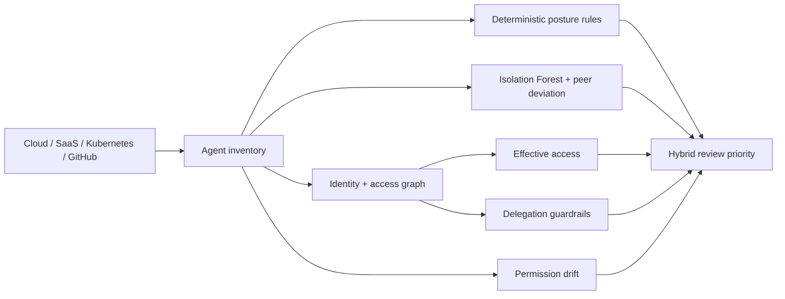
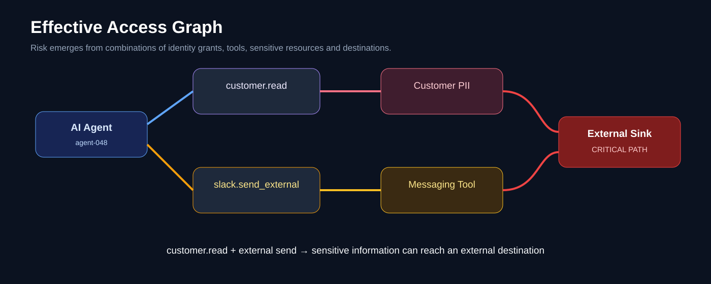
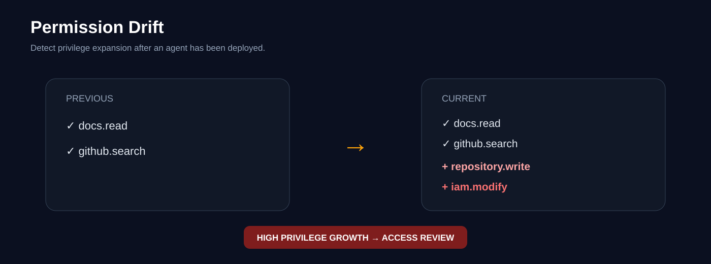

# AgentAtlas

### AI Agent Posture Management · Identity Governance · Hybrid ML

AgentAtlas is a defensive AI-agent security lab for discovering managed and shadow agents, analyzing effective access, detecting permission drift, enforcing delegation boundaries, and prioritizing unusual agent identities with an explainable ML layer.

> **Core question:** What AI agents exist, what can they actually reach, and which agents behave differently enough from their peers to deserve review first?



## Architecture



AgentAtlas deliberately keeps **policy evidence and ML evidence separate**. The deterministic posture score remains auditable. The ML layer adds a bounded review-priority adjustment; it cannot erase explicit governance findings.

## Synthetic baseline

The deterministic enterprise fixture contains 120 synthetic AI agents.

| Metric | Value |
|---|---:|
| Agents | 120 |
| Managed | 111 |
| Shadow | 9 |
| Orphaned | 6 |
| Dormant | 42 |
| High / Critical posture | 8 |
| Critical posture | 2 |
| Mean deterministic posture score | 0.2457 |

The existing posture baseline remains unchanged by the ML addition.

## Hybrid ML layer

AgentAtlas now uses **Isolation Forest** for unsupervised agent-posture anomaly detection.

The model builds a reference cohort from synthetic agents that are:

- managed;
- owned and sponsored;
- below the deterministic low-risk threshold.

It then evaluates each agent across 12 posture, identity, and graph-derived features:

```text
max permission sensitivity
permission count
tool count
MCP server count
external destination count
managed vs shadow
owned vs orphaned
inactivity
agent autonomy
production environment
privileged scope count
critical effective-access path count
```

For every agent the ML layer returns:

- `anomaly_percentile` — unusualness relative to the synthetic low-risk reference cohort;
- `ml_outlier` — Isolation Forest outlier state;
- `peer_distance` — deviation from agents with a similar environment and identity type;
- `top_deviations` — the features that most distinguish the agent from its peers;
- `hybrid_priority` — deterministic posture score plus a bounded ML prioritization adjustment.

The anomaly percentile and hybrid priority are **not probabilities of compromise**.

Detailed methodology: [`docs/ml.md`](docs/ml.md).

## Why combine rules + ML?

A pure rule engine catches explicit conditions such as a shadow identity, privileged scope, or external export path. ML helps surface combinations that are unusual even when no single rule is decisive.

```text
Deterministic governance rules
          +
Unsupervised anomaly detection
          +
Peer-group deviation
          +
Effective-access graph
          ↓
Explainable access-review priority
```

This design is useful for enterprise agent estates where thousands of service identities may be technically allowed but only a small subset are behaviorally or structurally unusual.

## Deterministic posture model

The original explainable score is preserved:

```text
risk = 0.05
     + 0.33 × max(permission_weight)
     + 0.32 if shadow / unmanaged
     + 0.27 if owner or sponsor is missing
     + 0.14 if inactive > 90 days
     + 0.10 if production autonomy >= 3
     + 0.12 if external egress exists
     + 0.10 if permission count >= 6
     + 0.08 if data.export + external egress
```

Representative high-impact permissions include `secrets.read`, `iam.modify`, `payments.write`, and `k8s.admin`.

## Effective-access graph

AgentAtlas distinguishes assigned permissions from what an agent can accomplish through combined capabilities.



Example:

```text
Customer PII
    ↓ customer.read
AI Agent
    ↓ data.export / slack.send_external
External destination

Finding: critical effective-access path
```

Critical-path counts also become ML features, linking graph structure to anomaly prioritization.

## Permission drift



AgentAtlas compares current and previous permission sets and highlights privilege expansion.

Representative synthetic changes include:

| Agent | Change | Risk delta | Severity |
|---|---|---:|---|
| `agent-020` | + `iam.modify`, + `repository.write` | 1.02 | Critical |
| `agent-030` | + `payments.write` | 0.82 | Critical |
| `agent-048` | + `data.export`, + `slack.send_external` | 0.72 | High |
| `agent-075` | - `secrets.read` | -0.58 | Low |

## Delegation guardrail

The delegation engine enforces a simple security invariant:

> A downstream agent cannot request authority that the originating identity did not grant.

```text
Human → Research Agent → Data Agent → privileged request
                                  ↓
                     ALLOW or DENY from origin scope
```

This remains deterministic because authorization policy should not be delegated to an anomaly model.

## Report output

`python -m agentatlas.cli` now returns both rule and ML evidence, including:

```json
{
  "summary": {"agents": 120},
  "ml": {
    "model": "IsolationForest",
    "reference_population": "derived from low-risk synthetic agents",
    "features": ["..."],
    "outliers": "..."
  },
  "top_ml_anomalies": [
    {
      "agent_id": "agent-...",
      "rule_risk": 0.0,
      "anomaly_percentile": 0.0,
      "peer_distance": 0.0,
      "hybrid_priority": 0.0,
      "top_deviations": ["..."]
    }
  ]
}
```

Values in this example are schematic; executable output is generated from the synthetic fixture at runtime.

## API & dashboard

FastAPI:

```bash
pip install -r requirements-api.txt
uvicorn api.app:app --host 0.0.0.0 --port 8000
```

Streamlit:

```bash
pip install -r requirements-dashboard.txt
streamlit run dashboard/app.py
```

## Run locally

```bash
python -m pip install -r requirements-api.txt -r requirements-dashboard.txt
python -m agentatlas.cli
python -m unittest discover -s tests -v
```

Docker:

```bash
docker build -t agentatlas .
docker run --rm -p 8000:8000 agentatlas
```

## Evaluation boundary

All identities, permissions, agent relationships, access paths, and ML observations are **synthetic**. The ML tests establish deterministic execution and sensible prioritization on the fixture; they do not establish production precision, recall, calibration, or incident-prediction performance.

A production evolution would use authorized enterprise agent telemetry, observed tool calls, business-role peer groups, analyst dispositions, incident labels, drift monitoring, threshold calibration, and retraining governance.

AgentAtlas does not modify real identities, permissions, SaaS tenants, or production systems.
