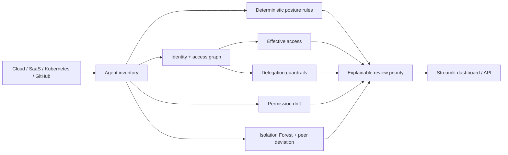

<div align="center">

# 🤖🛡️ AgentAtlas

### AI Agent Posture Management · Identity Governance · Hybrid ML

**Discover AI agents, map what they can actually reach, detect permission drift, and prioritize unusual identities without letting ML override explicit governance controls.**

[](https://github.com/VinayK88/AgentAtlas/actions/workflows/ci.yml)


**inventory → access graph → posture → anomaly → drift → review**

[Dashboard](#analyst-dashboard) · [Architecture](#architecture) · [ML](#hybrid-ml-layer) · [Quick Start](#quick-start)

</div>

<p align="center"></p>

---

## Why AgentAtlas

Enterprise AI agents behave like service identities with tools, scopes, delegated authority, data access, and external destinations. The important question is not only **“is this agent registered?”** but:

> **What AI agents exist, what can they effectively reach, how has their authority changed, and which agents differ enough from their peers to deserve review first?**

AgentAtlas keeps four evidence layers visible instead of collapsing everything into a black-box score:

| Layer | Question |
|---|---|
| **Inventory** | Is the agent managed, owned, sponsored, active, and known? |
| **Effective access graph** | What can the agent reach through combined permissions and tools? |
| **Governance rules** | Are explicit posture or delegation controls violated? |
| **Hybrid ML** | Is the agent unusually configured relative to an appropriate reference population? |

## 60-second reviewer path

1. Start with the dashboard above.
2. Follow the [architecture](#architecture).
3. Inspect the [effective-access graph](#effective-access-graph).
4. Review [permission drift](#permission-drift) and the deterministic delegation boundary.
5. See how the [Isolation Forest layer](#hybrid-ml-layer) adds review priority without replacing policy.

## Architecture



**Policy evidence and ML evidence stay separate.** The deterministic posture layer remains auditable; ML can increase review priority, but it cannot erase an explicit governance finding or grant authority.

## Synthetic posture baseline

The deterministic enterprise fixture contains **120 synthetic AI agents**.

| Metric | Value |
|---|---:|
| Agents | **120** |
| Managed | **111** |
| Shadow | **9** |
| Orphaned | **6** |
| Dormant | **42** |
| High / Critical posture | **8** |
| Critical posture | **2** |
| Mean deterministic posture score | **0.2457** |

These values validate the synthetic fixture and code path only; they are not production posture statistics.

## Hybrid ML layer

AgentAtlas uses **Isolation Forest** over posture, identity, and graph-derived features. The reference cohort is derived from synthetic agents that are managed, owned/sponsored, and below the deterministic low-risk threshold.

Representative features:

```text
permission sensitivity · permission count · tool count · MCP server count
external destinations · managed/shadow · owned/orphaned · inactivity
autonomy · production environment · privileged scopes · critical access paths
```

For every agent, the ML layer returns:

- `anomaly_percentile` — unusualness relative to the synthetic reference cohort;
- `ml_outlier` — Isolation Forest outlier state;
- `peer_distance` — deviation from a similar environment / identity peer group;
- `top_deviations` — strongest features separating the agent from peers;
- `hybrid_priority` — deterministic posture plus a bounded ML prioritization adjustment.

**The anomaly percentile is not a probability of compromise.** See [`docs/ml.md`](docs/ml.md) for the detailed methodology.

## Effective-access graph

<p align="center"></p>

Assigned permissions rarely tell the whole story. AgentAtlas models combined capabilities so reviewers can see paths such as:

```text
Sensitive data
    ↓ read permission
AI agent
    ↓ export / external-send capability
External destination
```

Critical-path counts also become ML features, linking structural reach to review prioritization.

## Permission drift

<p align="center"></p>

AgentAtlas compares previous and current permission sets and highlights privilege expansion. The key distinction is **current posture vs change over time**: an agent can remain technically allowed while a sudden scope increase still deserves investigation.

Representative synthetic examples include additions such as `iam.modify`, `repository.write`, `payments.write`, `data.export`, or external-send capability, as well as privilege reduction.

## Delegation guardrail

Authorization remains deterministic:

> **A downstream agent cannot request authority that the originating identity did not grant.**

```text
Human / service identity
        ↓ delegated scope
Research agent
        ↓ sub-delegation
Data agent
        ↓ privileged request
ALLOW only if origin scope permits it
```

An anomaly model may say that a sequence is unusual; it does not decide what authority exists.

## Analyst dashboard

Run the Streamlit workbench:

```bash
pip install -r requirements-dashboard.txt
streamlit run dashboard/app.py
```

The dashboard brings together inventory health, deterministic posture, ML anomaly evidence, effective-access paths, permission drift, and prioritized agent review.

FastAPI:

```bash
pip install -r requirements-api.txt
uvicorn api.app:app --host 0.0.0.0 --port 8000
```

## Quick start

```bash
git clone https://github.com/VinayK88/AgentAtlas.git
cd AgentAtlas
python -m venv .venv
source .venv/bin/activate
python -m pip install -r requirements-api.txt -r requirements-dashboard.txt
python -m agentatlas.cli
python -m unittest discover -s tests -v
```

Docker:

```bash
docker build -t agentatlas .
docker run --rm -p 8000:8000 agentatlas
```

## Portfolio signal

AgentAtlas demonstrates a distinct AI-security problem:

```text
AgentShield   → runtime tool-call authorization and safeguard measurement
AegisMesh     → multi-agent security orchestration
AgentAtlas    → AI-agent inventory, posture, effective access, drift, and identity governance
```

## Evaluation boundary

All identities, permissions, agent relationships, access paths, and ML observations are **synthetic**. The project demonstrates governance architecture, graph reasoning, anomaly prioritization, and software integration; it does not establish production precision, recall, calibration, or compromise prediction.

A production implementation would require authorized enterprise agent telemetry, observed tool calls, role-aware peer groups, analyst dispositions, drift monitoring, threshold calibration, and retraining governance.

AgentAtlas does not modify real identities, permissions, SaaS tenants, or production systems.

---

<div align="center">

**Inventory tells you what exists. The graph tells you what it can reach. Drift and ML tell you what deserves attention next.**

</div>
