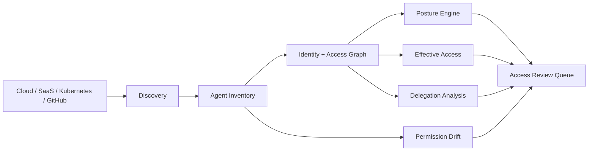

# AgentAtlas

Enterprise AI agent discovery, identity governance, effective-access analysis, delegation risk, permission drift, and shadow-agent detection.

> **Important:** AgentAtlas uses a deterministic **posture-scoring heuristic**, not a trained machine-learning classifier. A score such as `0.73` means “higher governance priority than a lower-scoring agent”; it is **not** a 73% probability of compromise.

## What AgentAtlas answers

- What AI agents and MCP/tool integrations exist?
- Which agents are unmanaged, shadow, orphaned, dormant, or overprivileged?
- Who owns and sponsors each agent identity?
- What sensitive resources can an agent effectively reach through tools and delegation?
- Has an agent's permission surface drifted?
- Does a downstream agent request exceed the authority delegated by the originating user?
- Which agents should be reviewed first?


## Architecture



## Baseline

The deterministic synthetic enterprise fixture contains 120 AI agents:

| Metric | Value |
|---|---:|
| Agents | 120 |
| Managed | 111 |
| Shadow | 9 |
| Orphaned | 6 |
| Dormant | 42 |
| High / Critical | 8 |
| Critical | 2 |
| Mean posture score | 0.2457 |

The checked-in `reports/baseline.json` is generated from the same executable code used by the CLI. CI compares the checked-in report with the current implementation to catch silent drift.

## Posture model

AgentAtlas ranks agents using a transparent, deterministic risk heuristic. The model is intentionally easy to audit and explain during access reviews.

### Inputs

The posture score uses:

| Signal | Why it matters |
|---|---|
| Highest-risk permission | A single highly privileged permission can dominate blast radius |
| Managed vs. shadow | Unmanaged agents may bypass normal inventory and lifecycle controls |
| Owner / sponsor presence | Orphaned identities lack accountable ownership |
| Dormancy | Long-inactive identities are more likely to be forgotten or stale |
| Production autonomy | Highly autonomous production agents have more operational impact |
| External egress | External destinations increase potential data-loss paths |
| Permission breadth | Broad capability surfaces are harder to govern |
| Sensitive export path | `data.export` plus external egress creates a concrete exfiltration path |

### Current scoring formula

The implementation starts from a small baseline and adds transparent contributions:

```text
risk = 0.05
     + 0.33 × max(permission_weight)
     + 0.32 if shadow / unmanaged
     + 0.27 if owner or sponsor is missing
     + 0.14 if inactive > 90 days
     + 0.10 if production autonomy >= 3
     + 0.12 if external egress exists
     + 0.10 if permission count >= 6
     + 0.08 if data.export + external egress
```

The score is capped at `0.99`.

Representative permission weights:

| Permission | Weight |
|---|---:|
| `docs.read` | 0.02 |
| `github.search` | 0.03 |
| `customer.read` | 0.18 |
| `data.export` | 0.38 |
| `secrets.read` | 0.58 |
| `k8s.admin` | 0.70 |
| `iam.modify` | 0.72 |
| `payments.write` | 0.82 |

Severity bands:

```text
LOW       < 0.30
MEDIUM    0.30 – 0.5499
HIGH      0.55 – 0.7199
CRITICAL  >= 0.72
```

### Why use the highest-risk permission?

The baseline model intentionally uses the **maximum permission weight**, rather than summing every permission, so dozens of harmless read scopes do not automatically outweigh one dangerous administrative capability. Permission breadth is captured separately with the broad-permission feature.

This is a governance heuristic, not a statistically learned optimal weighting scheme. In a production system, these weights should be calibrated against real incidents, analyst review outcomes, environment criticality, and business impact.

## Worked posture examples

### Example A — ordinary managed research agent

```text
managed                yes
owner / sponsor        present
environment            development
autonomy               1
permissions            docs.read, github.search, web.search
external destinations  none
```

Expected interpretation: **low posture risk**. The agent is discoverable, owned, narrowly scoped, and has no external egress.

### Example B — shadow autonomous production agent

```text
managed                no
owner / sponsor        present
environment            production
autonomy               3
permissions            docs.read, data.export
inactive                > 90 days
```

The score increases because shadow status, dormancy, production autonomy, and the higher-risk permission are independent governance concerns.

### Example C — sensitive export path

```text
permissions:
  - customer.read
  - data.export
  - slack.send_external

external destinations:
  - external-slack
```

AgentAtlas can identify the compound capability:

```text
Customer PII
    ↓ customer.read
AI Agent
    ↓ data.export / slack.send_external
External Slack

Finding: CRITICAL effective-access path
```

## Model validation

The posture model is validated for **internal logical consistency**, not predictive accuracy against real-world labels.

CI tests assert that:

- all risk scores stay within `[0.0, 0.99]`;
- ranking is monotonically descending;
- becoming a shadow agent increases risk;
- becoming orphaned increases risk;
- adding a privileged permission increases risk;
- adding external egress increases risk;
- adding a sensitive export path increases risk;
- low-risk read permissions do not outweigh a privileged payment scope;
- checked-in baseline results match executable results.

These tests answer “does the model behave consistently with its stated design?” They do **not** prove that the weights are statistically calibrated for a real enterprise.

## Effective-access analysis

AgentAtlas distinguishes direct permissions from effective capability. An agent may have individually reasonable permissions that combine into a sensitive path.


Example:

```text
Finance Agent
  ├── reads → Warehouse
  │             └── contains → Customer PII
  └── can_call → External Messaging Tool

Finding:
Sensitive data can flow from an internal data source to an external destination through the same agent capability surface.
```

Effective-access analysis currently models paths for customer data, secrets, payment operations, enterprise export capability, and external messaging. Every configured external destination is expanded rather than considering only one sink.

## Permission drift

AgentAtlas compares current and previous permission sets and scores privilege expansion.


```text
Yesterday
research-agent
├── docs.read
├── github.search
└── web.search

Today
research-agent
├── docs.read
├── github.search
├── web.search
├── secrets.read       NEW
└── repository.write   NEW
```

Example deterministic drift findings:

| Agent | Change | Risk delta | Severity |
|---|---|---:|---|
| `agent-020` | + `iam.modify`, + `repository.write` | 1.02 | Critical |
| `agent-030` | + `payments.write` | 0.82 | Critical |
| `agent-048` | + `data.export`, + `slack.send_external` | 0.72 | High |
| `agent-075` | - `secrets.read` | -0.58 | Low |

A negative delta means privilege was removed, not that the agent has “negative risk.”

## Delegation guardrail

The delegation engine enforces a simple invariant:

> A downstream agent cannot request a scope that was not present in the originating authority.

```text
Human
  │ grants READ
  ▼
Research Agent
  │ delegates
  ▼
Data Agent
  │ requests WRITE
  ▼
Customer Database

DENY
Reason: requested downstream capability exceeds originating authority
```

Representative cases:

```text
origin scopes: docs.read, customer.read
requested:     customer.read
result:        ALLOW

origin scopes: github.search
requested:     repository.write
result:        DENY

origin scopes: finance.read
requested:     payments.write
result:        DENY
```

Malformed chains, empty originating scope sets, and empty requested scopes are rejected instead of silently evaluated.

## API examples

Start the service:

```bash
pip install -r requirements-api.txt
uvicorn api.app:app --host 0.0.0.0 --port 8000
```

Health:

```bash
curl http://localhost:8000/health
```

```json
{
  "status": "ok",
  "service": "agentatlas"
}
```

Enterprise posture summary:

```bash
curl http://localhost:8000/summary
```

```json
{
  "agents": 120,
  "managed": 111,
  "shadow": 9,
  "orphaned": 6,
  "dormant": 42,
  "high_or_critical": 8,
  "critical": 2,
  "mean_risk": 0.2457
}
```

Inspect one agent:

```bash
curl http://localhost:8000/agents/agent-048
```

The response includes the synthetic identity record, posture score/reason codes, and effective-access paths. Unknown agent IDs return HTTP `404`.

## Dashboard

```bash
pip install -r requirements-dashboard.txt
streamlit run dashboard/app.py
```

The workbench contains six views:

1. Executive Posture
2. Agent Inventory
3. Effective Access
4. Delegation Chains
5. Permission Drift
6. Access Reviews

The dashboard is runtime-smoke-tested in GitHub Actions, not just syntax-compiled.

## CI / runtime verification

GitHub Actions runs on Python 3.11 and 3.12 and verifies:

```text
unit + API tests
baseline consistency
CLI report generation
module compilation
FastAPI startup + /health
Streamlit startup + health endpoint
Docker build
Docker container startup + /health   (Python 3.12 job)
```

This catches failures that pure unit tests or `py_compile` alone would miss.

## Repository layout

```text
agentatlas/            core governance and access logic
api/                   FastAPI service
dashboard/             Streamlit analyst workbench
assets/                README-native visuals
docs/                  threat model
reports/               deterministic baseline
tests/                 core, API, model-invariant tests
.github/workflows/     CI + runtime smoke checks
```

## Run locally

```bash
python -m agentatlas.cli
python -m unittest discover -s tests -v
```

Docker:

```bash
docker build -t agentatlas .
docker run --rm -p 8000:8000 agentatlas
```

## What this project does not claim

AgentAtlas does **not** claim that:

- its weights are learned from production incidents;
- its posture score is a probability of compromise;
- the synthetic baseline represents a real company's agent estate;
- its severity thresholds are universally optimal;
- it replaces enterprise IAM, CIEM, CSPM, or human access reviews.

A production evolution would use real discovery connectors, observed access logs, business criticality, analyst dispositions, incident labels, calibration studies, policy versioning, and continuous monitoring.

## Scope

All identities, agents, resources, permissions, MCP servers, destinations, scores, and findings are synthetic. AgentAtlas is a defensive research and portfolio project; it does not connect to or modify real enterprise identities or production systems.
